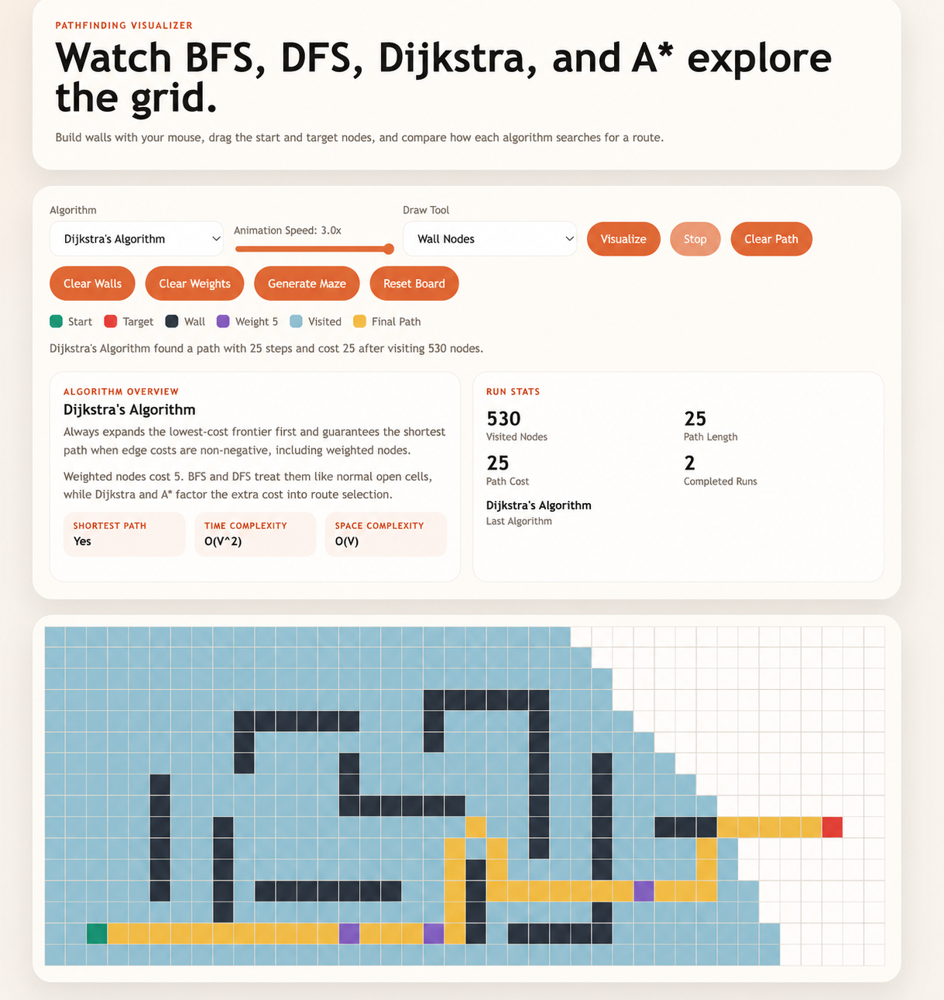

# Pathfinding Visualizer

Interactive visualizer for BFS, DFS, Dijkstra, and A* pathfinding algorithms.

## Features

- React + Vite app written in plain JavaScript
- Grid rendered with regular DOM elements, not canvas
- Click and drag to draw or erase walls
- Place weighted nodes to influence path cost
- Generate random mazes directly from the controls panel
- Drag the start and target nodes to test different layouts
- Toggle diagonal movement as an optional search rule
- Prepare and step through runs frame by frame
- Adjustable animation speed, animated traversal, and final path rendering
- Pure JavaScript implementations of BFS, DFS, Dijkstra, and A*
- Unit tests for pathfinding algorithms and grid utilities

## Getting Started

```bash
npm install
npm run dev
```

Then open the local Vite URL in your browser.

Run the tests with:

```bash
npm test
```

## Demo



- Live demo: coming soon
- Local demo: run `npm run dev`

## Project Structure

```text
pathfinding-visualizer/
├── assets/
│   └── pathfinding-visualizer-demo.png
├── src/
│   ├── algorithms.js
│   ├── App.jsx
│   ├── grid.js
│   ├── main.jsx
│   └── styles.css
├── .gitignore
├── index.html
├── LICENSE
├── package.json
├── package-lock.json
└── README.md
```

## Controls

- Choose an algorithm from the dropdown
- Choose between wall drawing, weighted nodes, or erasing
- Switch between auto-play and step-by-step playback
- Toggle diagonal movement on or off
- Click `Visualize` to animate the search
- Click `Prepare Steps` and `Step Forward` to inspect a run one frame at a time
- Use `Generate Maze` to create a random layout
- Click and drag on the grid to place or remove walls
- Use `Clear Weights` to remove weighted nodes without clearing walls
- Drag the green start node or red target node to move them
- Use `Clear Path`, `Clear Walls`, or `Reset Board` as needed

## Notes

- The implementation focuses on correctness and readability over optimization
- Weighted nodes have a movement cost of `5`
- BFS and DFS ignore weighted cost, while Dijkstra and A* use it
- Diagonal movement uses 8-direction traversal with corner cutting disabled
- The app is ready for deployment on Vercel or Netlify as a standard Vite project
- The UI includes algorithm descriptions, shortest-path guarantees, and complexity details
- The layout is tuned for both desktop and smaller mobile screens

## Future Improvements

- Add saved presets or board import/export
- Add more deterministic maze generation patterns
- Add performance-focused data structures for larger grids